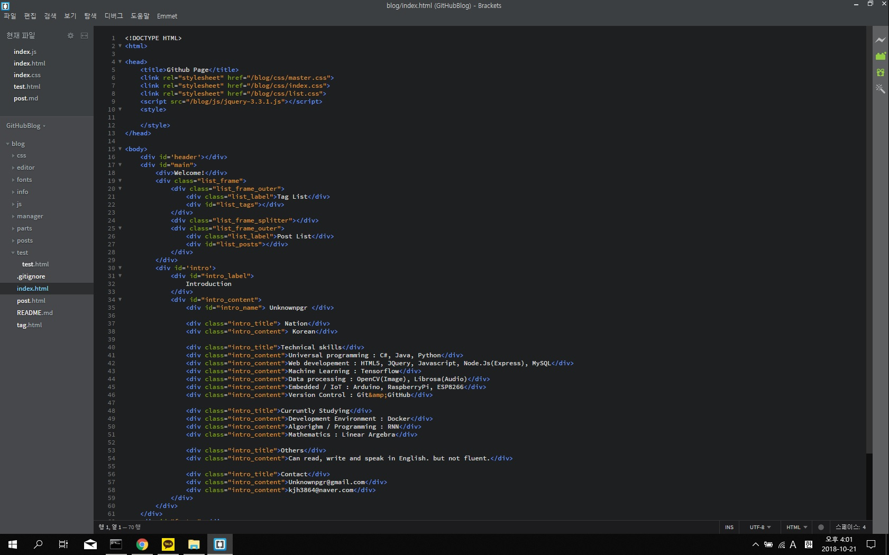

This is title
===

Hello. I'm __MarkDown__!  
This is static web page.  
But looks dynamic!  
I built this blog by myself.  
Not used jekyll.  

---

# Tests of markdown
* This is large title and content.  

## This is small title
* ...And content.  

---

How about _italic_ letter?  
How about images like this?
